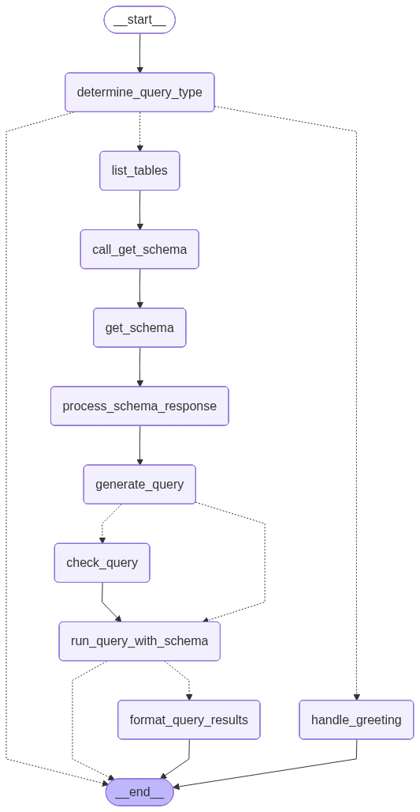

# Patient Informatics AI Assistant

A Health Informatics AI assistant designed for healthcare professionals to interact with patient data using natural language. This application leverages Google's Gemini models and LangGraph to intelligently query a SQL database and provide medical insights.

## 🚀 Features

- **Natural Language to SQL**: Converts medical questions into accurate SQL queries.
- **Intelligent Agent Workflow**: Uses LangGraph to validate, execute, and format queries.
- **Patient Data Analysis**: Specific focus on patient treatments, conditions, and history.
- **Interactive UI**: React-based chat interface with "Thinking" process visualization.
- **Dockerized**: Fully containerized for easy deployment.

## 🛠️ Tech Stack

- **Frontend**: React, Vite, Nginx
- **Backend**: FastAPI, Uvicorn, Python 3.12
- **AI & Orchestration**: LangChain, LangGraph, Google Gemini (gemini-2.0-flash)
- **Database**: SQLite
- **Infrastructure**: Docker, Docker Compose, Google Cloud Run

## 🧠 Agent Workflow

The core logic is powered by a LangGraph state machine that handles routing, schema retrieval, query generation, validation, and result formatting.



*Note: The graph image is generated automatically by the backend application.*

## 📦 Installation & Setup

### Prerequisites

- Docker and Docker Compose
- Google Cloud API Key (Gemini)

### 1. Clone the Repository

```bash
git clone <repository-url>
cd health_informatic
```

### 2. Configure Environment Variables

Create a `.env` file in the root directory (see `.env.example` or provided context):

```env
GOOGLE_API_KEY=your_google_api_key_here
GOOGLE_MODEL_NAME=gemini-2.0-flash
DATABASE_NAME=health_informative.db
PROJECT_NAME="Patient Informatics AI Assistant"
```

### 3. Run with Docker Compose

```bash
docker-compose up --build
```

The application will be available at:
- **Frontend**: http://localhost:3000
- **Backend API**: http://localhost:8080
- **API Docs**: http://localhost:8080/docs

## 🔧 Development

### Backend

```bash
cd backend
python -m venv venv
source venv/bin/activate  # or venv\Scripts\activate on Windows
pip install -r requirements.txt
uvicorn app.main:app --reload
```

### Frontend

```bash
cd frontend
npm install
npm run dev
```

## 📄 License

[License Information]